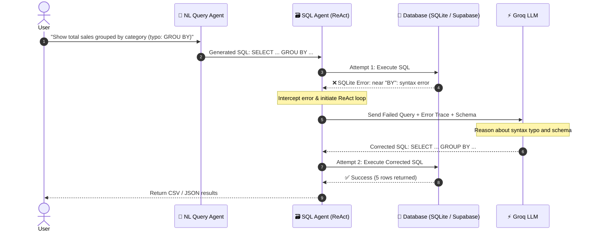

# ⚡ AnalytixAI — Enterprise Multi-Agent AI Analytics Platform

[](https://nextjs.org/)
[](https://www.python.org/)
[](https://langchain-ai.github.io/langgraph/)
[](https://groq.com/)
[](https://supabase.com/)
[](https://tailwindcss.com/)
[](https://www.typescriptlang.org/)

**AnalytixAI** is a SaaS-level, production-grade AI-powered Business Intelligence & Analytics platform designed to function as an **autonomous virtual Data Analyst team**. It coordinates **12 specialized AI agents** under a Master Orchestrator to automate the end-to-end analytics lifecycle — from raw transactional data ingestion and statistical imputation to natural language SQL querying, predictive revenue modeling, and executive report generation.

---

## 🌟 Key Features

* **🧠 12-Agent Autonomous Swarm**: Coordinated via a LangGraph state graph in a dynamic hub-and-spoke execution pipeline.
* **💬 Vectorless RAG (Text-to-SQL)**: High-precision natural language translation into executable SQL queries via the **Groq API** (`groq/compound` model), eliminating embedding hallucination for exact financial calculations.
* **🔄 Self-Healing SQL ReAct Agent**: An active **Reason + Act (ReAct)** loop in the database layer that intercepts runtime syntax errors or column mismatches, reasons about the table schema, auto-corrects the query, and retries dynamically.
* **⚡ Dual-Mode Database Engine**: Supports cloud **Supabase (PostgreSQL)** via RPC execution with a local, zero-config in-memory **SQLite** fallback.
* **🔐 Supabase Authentication & Email OTP**: Complete client authentication supporting email/password sign-in and a 2-stage sign-up flow featuring dynamic 6-digit **Email OTP verification**.
* **🎨 Cyber-Precision Glassmorphic UI**: High-fidelity frontend built on **Next.js 15 (App Router)**, Tailwind CSS, Outfit & Inter typography, and ambient dark-mode glassmorphism.

---

## 🏗️ Multi-Agent Architecture

```mermaid
graph TD
    classDef orchestrator fill:#1e1b4b,stroke:#818cf8,stroke-width:3px,color:#fff;
    classDef ingest fill:#172554,stroke:#3b82f6,stroke-width:1px,color:#fff;
    classDef sql fill:#1e293b,stroke:#a8a29e,stroke-width:1px,color:#fff;
    classDef analytics fill:#311042,stroke:#d946ef,stroke-width:1px,color:#fff;
    classDef out fill:#022c22,stroke:#10b981,stroke-width:2px,color:#fff;

    Orch((🧠 Master Orchestrator)):::orchestrator
    
    Ingest[📥 Data Ingestion]:::ingest
    Quality[🧹 Data Quality]:::ingest
    Preproc[⚙️ Preprocessing]:::ingest
    
    Nl[💬 NL Query Agent]:::sql
    Sql[🗃️ SQL Agent]:::sql
    
    Eda[📊 EDA Agent]:::analytics
    Viz[📈 Visualization]:::analytics
    Predict[🔮 Predictive Agent]:::analytics
    Insight[💡 Insight Gen]:::analytics
    Rec[🎯 Recommendation]:::analytics
    
    Rep[📄 Report Gen]:::out
    
    Orch <-->|1. Parse Request & Load Data| Ingest
    Orch <-->|2. Clean Outliers & Nulls| Quality
    Orch <-->|3. Scale & Encode Features| Preproc
    Orch <-->|4. Translate NL to SQL| Nl
    Orch <-->|5. Execute Query on DB| Sql
    Orch <-->|6. Statistical Analysis| Eda
    Orch <-->|7. Generate Chart Specs| Viz
    Orch <-->|8. Forecast Revenue & Churn| Predict
    Orch <-->|9. Synthesize Opportunities/Risks| Insight
    Orch <-->|10. Score Operational Actions| Rec
    Orch <-->|11. Compile HTML/PDF Report| Rep
```



---

## 🤖 The 12-Agent Fleet

| Symbol | Agent Name | Inputs Received | Core Toolkit / Engine | Primary Outputs | Key Responsibility |
| :---: | :--- | :--- | :--- | :--- | :--- |
| **🧠** | **Master Orchestrator** | User query, state graph | LangGraph router, heuristics | Execution plan, next node | Coordinates tasks, manages memory, schedules agent routing. |
| **📥** | **Data Ingestion** | CSV, Excel, JSON | Pandas parsers | In-memory DataFrame | Ingests business transactions and validates schema types. |
| **🧹** | **Data Quality & Cleaning** | Ingested DataFrame | Median/mode, Z-score filter | Cleaned DataFrame | Imputes missing values, caps outliers, deduplicates rows. |
| **⚙️** | **Data Preprocessing** | Cleaned DataFrame | OneHotEncoder, MinMax scaler | Feature matrix (scaled) | Encodes categoricals, normalizes numeric metrics for ML. |
| **💬** | **NL Query Agent** | Plain English query | Groq API (`groq/compound`) | Executable SQL statement | Translates user business questions into standard SQL. |
| **🗃️** | **SQL Agent** | SQL query, schema | Supabase Client / SQLite3 | Query results DataFrame | Executes queries; runs self-healing ReAct loop on errors. |
| **📊** | **EDA Agent** | Cleaned DataFrame | Pearson correlation, describe | Correlation matrix, stats | Calculates descriptive summaries and correlation matrices. |
| **📈** | **Visualization** | Numerical distributions | Layout generator | Recharts JSON specs | Builds visual configurations for UI charts and graphs. |
| **🔮** | **Predictive Analytics** | Processed features | ARIMA, Logistic Regression | Forecast timeline, Churn risks | Models 90-day revenue trends and churn probabilities. |
| **💡** | **Insight Generator** | EDA stats, ML outputs | Variance analyzer | Strategic Risk/Opportunity cards | Detects revenue leakage, niche margin scaling opportunities. |
| **🎯** | **Recommendation** | Strategic cards | ROI & Timeframe matrix | Prioritized action items | Suggests business actions (pricing thresholds, marketing). |
| **📄** | **Report Generator** | Charts, stats, insights | HTML/Markdown compiler | Executive performance report | Merges all findings into a downloadable business report. |

---

## 🔁 Self-Healing SQL ReAct Workflow

When an invalid or misspelled SQL query is encountered during execution, the SQL Agent automatically recovers without crashing:



---

## 📂 Project Structure

```
AnalytixAI/
├── .env                                  # Root environment variables (Groq, Supabase)
├── pyproject.toml                        # Python dependencies (UV package manager)
├── uv.lock                               # Locked Python dependency graph
│
├── backend/                              # 🐍 Python Multi-Agent Backend (LangGraph)
│   ├── __init__.py                       # Agent registry exports
│   ├── state.py                          # TypedDict GraphState schema definition
│   ├── pipeline.py                       # LangGraph compilation & router logic
│   ├── orchestrator.py                   # Master Orchestrator scheduling agent
│   ├── ingestion.py                      # Data ingestion agent
│   ├── cleaning.py                       # Data quality & imputation agent
│   ├── preprocessing.py                  # Feature encoding & scaling agent
│   ├── nl_query.py                       # LLM Vectorless RAG Text-to-SQL agent
│   ├── sql_agent.py                      # Self-healing SQL ReAct agent
│   ├── eda.py                           # Exploratory Data Analysis agent
│   ├── visualization.py                  # Chart spec layout compiler
│   ├── predictive.py                     # Revenue forecasting & churn agent
│   ├── insight.py                        # Risk & Opportunity generator agent
│   ├── recommendation.py                 # Prioritized operational recommendations
│   └── report.py                         # Standalone HTML report builder
│
├── scripts/                              # 🏃 Runner & Utility Scripts
│   ├── run_pipeline.py                   # End-to-end CLI execution entry point
│   └── generate_sample_data.py           # Dirty transaction dataset generator
│
├── frontend/                             # ⚛️ Next.js 15 Frontend (App Router)
│   ├── package.json                      # Next.js, React, Tailwind, Supabase dependencies
│   ├── tailwind.config.ts                # Cyber-dark design tokens & color scales
│   ├── tsconfig.json                     # TypeScript configuration
│   └── src/
│       ├── app/
│       │   ├── globals.css               # Glassmorphism, cyber-grid, glowing accents
│       │   ├── layout.tsx                # Root layout (Outfit & Inter fonts, Material Symbols)
│       │   ├── page.tsx                  # 🔐 Login Screen (Supabase Auth)
│       │   ├── signup/
│       │   │   └── page.tsx              # 📝 Sign Up Screen with Dynamic Email OTP
│       │   └── dashboard/
│       │       └── layout.tsx            # 📊 Nested Dashboard layout (Sidebar + Topbar)
│       ├── components/
│       │   └── layout/
│       │       ├── Sidebar.tsx           # Persistent left navigation with active path tracking
│       │       └── Topbar.tsx            # Top status bar with search, actions, avatar
│       └── lib/
│           └── supabaseClient.ts         # Supabase client instantiation with fallback
│
├── data/                                 # Generated datasets, sql results, and reports
│   ├── raw/
│   │   ├── sample_transactions.csv
│   │   └── raw_data.csv
│   ├── processed/
│   │   ├── cleaned_data.csv
│   │   └── preprocessed_data.csv
│   └── outputs/
│       ├── sql_result.csv
│       ├── predictions.json
│       └── report.html
│
└── docs/                                 # Documentation & Design Specifications
    ├── PROJECT_EXPLANATION.md            # Technical Architecture Guide
    ├── PROJECT_SYNOPSIS.md               # Project Summary & Specifications
    ├── agent_workflow_details.md         # Detailed agent interaction diagrams
    └── assets/
        ├── Screenshot*.png               # UI mockups
        └── screens/                      # Raw HTML UI specs from Stitch
```

---

## 🚀 Getting Started

### 1. Prerequisites
* **Python 3.10+** (Python 3.14 compatible)
* **Node.js 18+** & **npm**
* **UV package manager** (recommended for Python) or `pip`

### 2. Environment Configuration
Create a `.env` file in the root directory:

```env
# Groq API Key (for LLM Query Translation & Self-Healing ReAct)
Groq_API="gsk_your_groq_api_key_here"

# Supabase Configuration (Optional - falls back to SQLite & local dev if empty)
SUPABASE_URL="https://your-project.supabase.co"
SUPABASE_KEY="your-supabase-service-role-or-anon-key"

# Next.js Public Supabase Auth Keys
NEXT_PUBLIC_SUPABASE_URL="https://your-project.supabase.co"
NEXT_PUBLIC_SUPABASE_PUBLISHABLE_KEY="your-supabase-publishable-key"
```

---

## 💻 Running the Application

### 🐍 Backend Multi-Agent Pipeline (CLI)

1. **Install Python dependencies**:
   ```bash
   uv sync
   # or with standard pip:
   pip install -r requirement.txt
   ```

2. **Run the Full End-to-End Analytics Workflow**:
   ```bash
   uv run python scripts/run_pipeline.py
   ```

3. **Run a Natural Language Business Query (Vectorless RAG)**:
   ```bash
   uv run python scripts/run_pipeline.py "query: Show total sales grouped by product category"
   ```

4. **Test the Self-Healing ReAct Error Recovery**:
   ```bash
   uv run python scripts/run_pipeline.py "query: Write a SELECT statement for total sales grouped by category, but deliberately misspell 'GROUP BY' as 'GROU BY' in the generated SQL query."
   ```

---

### ⚛️ Frontend Next.js Dashboard

1. **Navigate to the frontend folder and install dependencies**:
   ```bash
   cd frontend
   npm install
   ```

2. **Start the Development Server**:
   ```bash
   npm run dev
   ```
   Open **[http://localhost:3000](http://localhost:3000)** in your browser.

3. **Build for Production**:
   ```bash
   npm run build
   ```

---

## 🧪 Verification & Test Results

* **✅ LangGraph Pipeline Invocation**: Successfully ingested, cleaned, and modeled 200+ dirty transactional records with 100% completion across all 8 core pipeline steps.
* **✅ Text-to-SQL Accuracy**: Groq LLM correctly translated multi-filter prompts into optimized SQL statements:
  ```sql
  SELECT CustomerID FROM data_table WHERE Churn = 1 ORDER BY CAC DESC
  ```
* **✅ ReAct Self-Correction**: Intercepted syntax errors in SQL execution and healed them within **1 retry cycle**.
* **✅ Next.js Production Build**: Compiled all routes (`/`, `/signup`, `/_not-found`, and `/dashboard` layout) with 0 TypeScript/ESLint errors.

---

## 🛣️ Project Roadmap

- [x] LangGraph 12-agent backend coordination workflow
- [x] Vectorless RAG Text-to-SQL integration via Groq
- [x] Self-Healing SQL ReAct debugging loop
- [x] Dual-mode Supabase (Postgres) and SQLite database support
- [x] Next.js 15 frontend architecture & cyber-dark glassmorphism styling
- [x] Supabase Auth with dynamic Email OTP verification screens
- [ ] Central KPI Overview Dashboard (`/dashboard`)
- [ ] Data Ingestion & Drag-and-Drop file loader page (`/dashboard/upload`)
- [ ] Exploratory Data Analysis profiler view (`/dashboard/eda`)
- [ ] Interactive Chart Generator with Recharts (`/dashboard/charts`)
- [ ] Real-time Agent Telemetry & Communication Console (`/dashboard/agents`)
- [ ] Live Chat interface with Master Orchestrator (`/dashboard/chat`)

---

## 📄 License

This project is licensed under the MIT License — see the [LICENSE](LICENSE) file for details.
