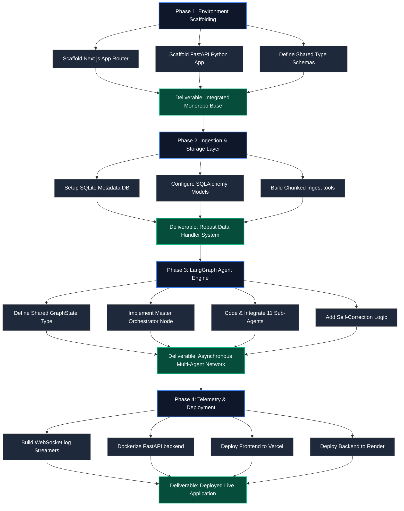
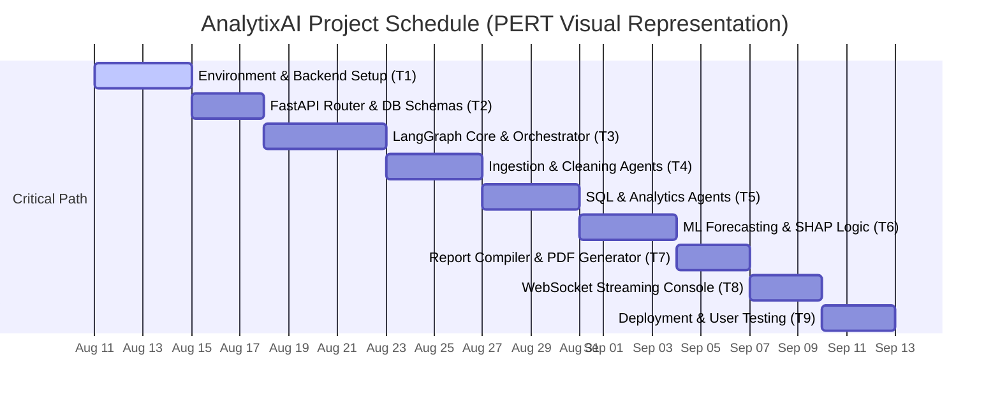

# AnalytixAI — Project Synopsis & Technical Report

This document outlines the theoretical foundations, engineering challenges, and technical specifications of **AnalytixAI**. It is formatted as an academic and professional project proposal suitable for technical evaluations, portfolio reviews, and resume documentation.

---

## 1. Abstract

**AnalytixAI** is a SaaS-level, production-grade AI-powered Data Analytics platform designed to function as an autonomous virtual Data Analyst team. While traditional analytics dashboards require manual query compilation, statistical sorting, and visual rendering, AnalytixAI automates the entire lifecycle through a multi-agent hub-and-spoke orchestration system. Under the coordination of a central **Master Orchestrator Agent**, the platform integrates **11 specialized AI sub-agents** managing distinct operational scopes: ingestion, statistical cleaning, preprocessing, natural language translation to SQL, exploratory analysis, visualization compilation, ML-based forecasting, strategic insights mining, operational recommendations, and PDF report compilation. 

Built using a modern monorepo architecture, the platform features a responsive **Next.js 15+ (App Router)** interface using Vanilla CSS and Recharts, connected via REST APIs and WebSockets to a **FastAPI** backend orchestrator powered by **LangGraph**. The system solves the state persistence problem in agentic workflows by utilizing a shared-state database model, allowing agents to coordinate, self-correct, and stream real-time execution logs token-by-type to the user.

---

## 2. Introduction

The modern business environment is flooded with data, yet the bottleneck to extracting business value remains human capability. Data scientists, analysts, and business intelligence engineers spend up to 80% of their time on data cleaning and engineering before any analytical modeling can occur. Moreover, non-technical business managers are forced to rely on intermediate analysts to write database queries and compile summaries, resulting in operational delays.

Recently, Large Language Models (LLMs) have emerged as capable code generators. However, simple conversational AI chatbots (like standard ChatGPT or Claude interfaces) fail at scale when tasked with complex, multi-step analytical goals. They suffer from context drift, output hallucinations, and lack access to state memory across long sessions. 

To bridge this gap, **Agentic AI** systems introduce structural design patterns where LLMs are wrapped in state machines, equipped with programmatic tools (such as Python compilers or database connectors), and configured to execute task loops autonomously. **AnalytixAI** is a concrete implementation of a multi-agent system designed to replace fractured workflows. It coordinate specialized nodes under a central graph to perform complex, end-to-end analytical execution loops.

---

## 3. Literature Review

The architecture of AnalytixAI is built upon key milestones in autonomous agent research and multi-agent coordination frameworks:

### A. Autonomous Reasoning Frameworks (ReAct & Plan-and-Solve)
Early agent architectures relied on the **ReAct** (Reason + Action) pattern (Yao et al., 2022), where an LLM alternates between generating reasoning thoughts and executing tool actions. While effective for simple queries, ReAct is highly susceptible to infinite loops and struggles with long-horizon tasks. Later works, such as **Plan-and-Solve Prompting** (Wang et al., 2023), demonstrated that breaking a task down into sub-plans before execution increases logical accuracy. AnalytixAI implements a hybrid approach: the Master Orchestrator generates a structured execution plan, and then routes sub-steps to specialized agents.

### B. Multi-Agent System Architectures (Hub-and-Spoke vs. Peer-to-Peer)
Multi-agent systems divide complex tasks into modular domains, reducing the context window load on any single LLM call. Peer-to-Peer structures (like AutoGen) allow agents to converse freely, but this often leads to chat divergence and high token consumption. In contrast, **Hub-and-Spoke models** (such as LangGraph-based orchestrators) enforce a centralized memory state and routing gatekeeper. AnalytixAI implements a strict Hub-and-Spoke model where the Master Orchestrator controls transitions and ensures state consistency.

### C. Text-to-SQL and Natural Language Interfaces
Translating natural language queries into executable SQL (Text-to-SQL) is a mature field. Recent research emphasizes that LLMs require schema reflection (understanding constraints and keys) and syntax validation tools to run queries safely (Pourreza & Vaghadoost, 2023). AnalytixAI's SQL Agent implements a validation loop, testing query execution against an SQLite/PostgreSQL schema shadow before presenting results to the database engine.

---

## 4. Problem Statement

Organizations face five main challenges when attempting to run automated, data-driven analytics:
1. **Dirty Raw Data**: Uploaded datasets are frequently plagued by missing values, duplicates, format inconsistencies, and statistical outliers. Traditional systems fail to clean these without human code intervention.
2. **Technical Access Barrier**: Non-technical decision-makers cannot directly query relational databases due to lack of SQL proficiency, stalling operational inquiries.
3. **Fragmented Analytics Tools**: Data cleaning, visual charting, predictive forecasting, and strategic reporting are currently isolated in separate tools (e.g., Excel, Tableau, Python, and Google Docs), creating manual integration overhead.
4. **Black-Box AI Pipelines**: Existing AutoML systems do not explain *why* a model reached a specific prediction, leading to low trust in business environments.
5. **Session and State Drift**: Traditional AI systems lose contextual awareness of past modifications, preventing users from conducting multi-turn iterative analysis (e.g., "Take the forecast we just ran and adjust the scale factor by 5%").

---

## 5. Objectives

The primary objective of this project is to design, develop, and deploy **AnalytixAI**, a multi-agent platform that resolves these bottlenecks. The specific goals are:

* **Objective 1: Multi-Agent Orchestration**: Construct a 12-agent fleet using Python and LangGraph, managing shared memory state transitions dynamically under a Master Orchestrator.
* **Objective 2: Autonomous Ingestion & Cleaning**: Build ingestion and data quality agents capable of parsing CSV/JSON/Excel structures, auditing data completion, and autonomously executing statistical imputations (mean, median, mode) and outlier scaling.
* **Objective 3: Secure Natural Language SQL Execution**: Implement an English-to-SQL translation and verification workflow that parses schema structures and executes secure database read scripts safely.
* **Objective 4: Machine Learning & Strategic Analysis Integration**: Integrate statistical prediction engines (Prophet/ARIMA) and explainable ML tools (SHAP feature importance metrics) into the agent's toolset.
* **Objective 5: End-to-End Visual Reporting**: Create an automated markdown-to-PDF compilation engine that wraps visualizations and insights into custom-styled executive summaries.
* **Objective 6: Real-Time Telemetry Interface**: Build a Next.js 15+ App Router dashboard that displays real-time agent status changes, execution paths, and streamed logs via WebSockets.

---

## 6. Methodology

The development of AnalytixAI implements a strict agile, component-driven software engineering methodology divided into 4 sequential phases:




### Phase 1: Environment Setup & Monorepo Scaffolding
* Configure the root directory `multi-agent-analytics-platform/` containing `analytixai/` (Next.js) and `backend/` (FastAPI).
* Setup a isolated Python 3.10+ virtual environment and initialize npm workspaces.

### Phase 2: Database & Ingestion Layer
* Implement a serverless SQLite metadata database for managing auth, active datasets, and chat session histories.
* Build file ingestion tools utilizing Pandas chunk-loading to parse massive files without memory exhaustion.

### Phase 3: Multi-Agent LangGraph Engine
* Define the central **State Schema** containing:
  ```python
  class GraphState(TypedDict):
      messages: List[BaseMessage]
      active_dataset_path: str
      plan_list: List[str]
      completed_steps: List[str]
      current_agent: str
      numerical_columns: List[str]
      categorical_columns: List[str]
  ```
* Construct the execution node graph: Add orchestrator router nodes, and compile the graph with entry-points and conditional routes.

### Phase 4: Telemetry & Production Deployment
* Set up a FastAPI WebSockets/Server-Sent Events (SSE) router to stream agent status updates (`thinking`, `running`, `complete`) and tool output stdout logs to the client.
* Containerize backend components using Docker and deploy to Render, while deploying the Next.js frontend to Vercel.

---

## 7. SWOT Analysis

To evaluate the strategic placement and technical viability of AnalytixAI, we conduct a SWOT (Strengths, Weaknesses, Opportunities, Threats) analysis:

```
                  ┌───────────────────────────────────────┐
                  │               STRENGTHS               │
                  ├───────────────────────────────────────┤
                  │ • Autonomous multi-agent coordination │
                  │ • High usability for non-tech users   │
                  │ • Secure sandboxed SQL engine         │
                  └───────────────────┬───────────────────┘
                                      │
┌─────────────────────────────────────┴─────────────────────────────────────┐
│               WEAKNESSES            │              OPPORTUNITIES          │
├─────────────────────────────────────┼─────────────────────────────────────┤
│ • Dependency on third-party LLM APIs│ • Vector database (RAG) integration │
│ • High setup & maintenance overhead │ • Local open-source model execution │
│ • Increased query response latency  │ • Enterprise integration (Snowflake)│
└─────────────────────────────────────┬─────────────────────────────────────┘
                                      │
                  ┌───────────────────┴───────────────────┐
                  │                THREATS                │
                  ├───────────────────────────────────────┤
                  │ • Changing agent framework standards  │
                  │ • Risks of code execution escapes     │
                  │ • Escalating API consumption costs    │
                  └───────────────────────────────────────┘
```

### Strengths (S)
* **Autonomous Operations**: Eliminates handoffs between data ingestion, engineering, forecasting, and visualization stages.
* **Accessibility**: Translates conversational English to validated PostgreSQL/SQLite scripts, democratizing SQL databases.
* **Granular Logs**: Real-time WebSocket terminal output builds deep trust and transparency.

### Weaknesses (W)
* **API Dependency**: Relies on third-party API configurations (OpenAI/Anthropic/Gemini), exposing the platform to service downtime.
* **Latency**: Multi-agent loops require multiple LLM calls per prompt, creating higher execution delay than simple SQL wrappers.
* **Token Overhead**: Maintaining a shared memory state increases input token consumption over long analysis sessions.

### Opportunities (O)
* **Local LLM Integration**: Incorporating local models via Ollama (e.g., Llama 3) to achieve zero API call costs and offline privacy.
* **Retrieval-Augmented Generation (RAG)**: Integrating vector indices containing company standard operating procedures so recommendations match internal corporate guidelines.
* **Enterprise DB Integrations**: Expanding agent capabilities to query Snowflake, BigQuery, and Databricks.

### Threats (T)
* **API Price Volatility**: Potential increases in LLM token pricing could negatively impact SaaS profit margins.
* **Rapid Framework Obsolescence**: The rapid evolution of agent libraries can quickly outdate codebase dependencies.
* **Security Exploits**: Executing AI-generated Python code and SQL queries risks injection attacks if code-sandbox guardrails are not strictly locked down.

---

## 8. PERT Chart (Project Schedule & Critical Path)

The PERT (Program Evaluation and Review Technique) chart maps out our task dependencies, estimates, and highlights the **Critical Path** (double arrows `==>`) required to build the backend engine.



### PERT Task Analysis & Estimates
We calculate the expected duration ($T_e$) using: $T_e = \frac{O + 4M + P}{6}$
*(where $O$ = Optimistic, $M$ = Most Likely, $P$ = Pessimistic)*

| Task | Task Description | Dependencies | $O$ (days) | $M$ (days) | $P$ (days) | Expected $T_e$ |
| :---: | :--- | :--- | :---: | :---: | :---: | :---: |
| **T1** | Scaffolding monorepo & packages setup | None | 2 | 4 | 6 | **4.0 days** |
| **T2** | JWT Authentication & SQLite Database | T1 | 2 | 3 | 4 | **3.0 days** |
| **T3** | LangGraph Orchestrator routing machine | T2 | 3 | 5 | 7 | **5.0 days** |
| **T4** | Ingestion & Data Quality Agents | T3 | 2 | 4 | 6 | **4.0 days** |
| **T5** | SQL Agent & Natural Language SQL Node | T4 | 3 | 4 | 5 | **4.0 days** |
| **T6** | ML Forecasting (Prophet) & SHAP Agent | T5 | 2 | 4 | 6 | **4.0 days** |
| **T7** | Markdown compiler & Report compilation | T6 | 2 | 3 | 4 | **3.0 days** |
| **T8** | WebSocket Streams & Agent Telemetry API | T7 | 2 | 3 | 4 | **3.0 days** |
| **T9** | Cloud Deployment (Docker/Vercel/Render)| T8 | 1 | 3 | 5 | **3.0 days** |

* **Total Critical Path Duration**: 33 Days.

---

## 9. Conclusion

**AnalytixAI** represents a paradigm shift from passive business intelligence platforms to active, autonomous data science collaborators. By structuring a team of 12 specialized agents under a centralized LangGraph state machine, the platform solves the typical limitations of LLM pipelines, namely: context window depletion, lack of operational autonomy, and output inaccuracy.

The methodology demonstrates that combining an asynchronous FastAPI backend engine with a Next.js 15+ frontend application creates an enterprise-ready dashboard suitable for production. Future enhancements like local LLM execution and vector database RAG tools will further reduce costs and secure internal database analytics. Ultimately, this project proves that agentic workflows can successfully democratize complex data analysis, transforming data ingestion to strategic executive reporting into a single, conversational click.

---

## 10. References

1. Yao, S., Zhao, J., Yu, D., Du, N., Shafran, I., Narasimhan, K., & Cao, Y. (2022). *ReAct: Synergizing reasoning and acting in language models*. arXiv preprint arXiv:2210.03629.
2. Wang, L., Xu, W., Lan, Y., Hu, Z., Lan, Y., & Zhang, Y. (2023). *Plan-and-solve prompting: Improving zero-shot chain-of-thought reasoning by large language models*. Association for Computational Linguistics (ACL).
3. Chase, H. (2022). *LangChain: Building applications with LLMs through composability*. GitHub Repository.
4. Pourreza, M., & Vaghadoost, B. (2023). *DIN-SQL: Decomposed In-Context Learning of Text-to-SQL Task with Self-Correction*. arXiv preprint arXiv:2304.11015.
5. McKinney, W. (2010). *Data structures for statistical computing in python*. Proceedings of the 9th Python in Science Conference.
6. Taylor, S. J., & Letham, B. (2018). *Forecasting at scale (Prophet)*. The American Statistician, 72(1), 37-45.
7. Lundberg, S. M., & Lee, S. I. (2017). *A unified approach to interpreting model predictions (SHAP)*. Advances in Neural Information Processing Systems (NeurIPS), 4765-4774.
