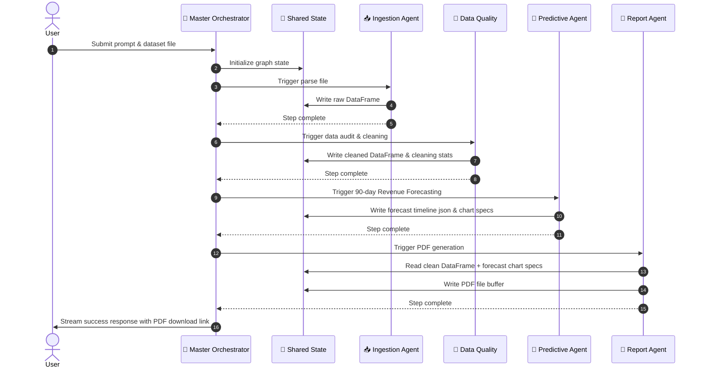

# AnalytixAI — Agent Work Definitions & Communication Graph

This document details the responsibilities, toolkits, inputs, outputs, and communication paths for each of the **12 specialized AI agents** operating in the AnalytixAI ecosystem.

---

## 1. Complete Agent Registry

Below is a detailed specification of each agent's duties, inputs, tools, and outputs.

| Symbol | Agent Name | Inputs Received | Core Tools Used | Primary Outputs | Responsibilities |
| :---: | :--- | :--- | :--- | :--- | :--- |
| **🧠** | **Master Orchestrator** | User query, current execution graph state, recent history | LLM Router, Planner Tool | Plan list, Next Active Agent node | Parses queries, builds task plans, schedules execution, and returns final streaming output. |
| **📥** | **Data Ingestion** | Sales CSV/JSON, CRM Excel sheets, DB Connection String | Pandas parsers, DB connector schemas | In-memory Dataframe, table schemas | Parses incoming transactional schemas, validates customer fields, and caches records in memory. |
| **🧹** | **Data Quality & Cleaning** | In-memory Dataframe | Median/mode calculators, Z-score filters | Audit logs, cleaned Dataframe | Scans for null purchase prices, duplicate transaction IDs, anomalies; performs statistical imputation. |
| **⚙️** | **Data Preprocessing** | Cleaned Dataframe | One-hot encoders, MinMax scalers | Encoded variables, scaled columns | Normalizes business features, encodes customer segment dimensions, and scales LTV/CAC factors. |
| **🗃️** | **SQL Agent** | Schema structure, user SQL target | SQLite/PostgreSQL execution engine | Row results table, execution logs | Generates secure SQL queries to fetch revenues, profit margins, and inventories. |
| **📊** | **EDA Agent** | Cleaned Dataframe | Pearson correlation, descriptive stats | Correlation matrix, AOV summaries | Calculates business descriptive statistics, computes price vs. volume elasticity correlations. |
| **📈** | **Visualization** | Target variables, chart configurations | Recharts-JSON compiler | Chart specs, dimensions JSON | Formulates plotting specs for cohort retention grids, sales trend lines, and margin breakdown charts. |
| **💡** | **Insight Generator** | EDA stats, ML forecasting outputs | Trend detectors, anomaly flags | Strategic Risk/Opportunity cards | Scans variances to identify revenue leakages, high-margin niches, and growth risks. |
| **🔮** | **Predictive Analytics** | Processed Dataframe | ARIMA, Prophet, XGBoost wrappers | Predictions timeline, confidence bounds | Forecasts future monthly/quarterly revenues and classifies customer churn probabilities. |
| **📄** | **Report Generator** | Charts, tables, insights, summaries | Markdown-to-PDF compilers | Final compiled PDF/HTML files | Assembles charts, tables, and summaries into downloadable Executive Performance Reports. |
| **💬** | **NL Query Agent** | Natural Language strings, DB schema | LLM SQL generator, parser | Runnable SQL statement | Converts plain English (e.g., *"What is our quarterly profit by region?"*) into validated SQL. |
| **🎯** | **Recommendation** | Strategic Risk/Opportunity cards | ROI & Timeframe scoring matrix | Prioritized action items | Suggests operational actions (pricing thresholds, marketing adjustments, restock levels). |

---

## 2. Multi-Agent Workflow Coordination Graph

This graph visualizes the hub-and-spoke routing logic managed by the **Master Orchestrator**. The orchestrator checks the shared state, updates the workspace, and routes tasks dynamically.

```mermaid
graph TD
    %% Styling
    classDef orchestrator fill:#1e1b4b,stroke:#818cf8,stroke-width:3px,color:#fff;
    classDef ingest fill:#172554,stroke:#3b82f6,stroke-width:1px,color:#fff;
    classDef clean fill:#172554,stroke:#3b82f6,stroke-width:1px,color:#fff;
    classDef sql fill:#1e293b,stroke:#a8a29e,stroke-width:1px,color:#fff;
    classDef analytics fill:#311042,stroke:#d946ef,stroke-width:1px,color:#fff;
    classDef out fill:#022c22,stroke:#10b981,stroke-width:2px,color:#fff;

    %% Nodes
    Orch((🧠 Master Orchestrator)):::orchestrator
    
    %% Ingest Spokes
    Ingest[📥 Data Ingestion]:::ingest
    Quality[🧹 Data Quality]:::ingest
    Preproc[⚙️ Preprocessing]:::ingest
    
    %% SQL Spokes
    Sql[🗃️ SQL Agent]:::sql
    Nl[💬 NL Query]:::sql
    
    %% Analytics Spokes
    Eda[📊 EDA Agent]:::analytics
    Viz[📈 Visualization]:::analytics
    Predict[🔮 Predictive]:::analytics
    Insight[💡 Insight Gen]:::analytics
    Rec[🎯 Recommendation]:::analytics
    
    %% Output Spokes
    Rep[📄 Report Gen]:::out
    
    %% Core Routing Edges
    Orch <-->|1. Parse & Ingest| Ingest
    Orch <-->|2. Clean Outliers| Quality
    Orch <-->|3. Scale Features| Preproc
    
    Orch <-->|4. Compile Natural Lang| Nl
    Orch <-->|5. Execute SQL Script| Sql
    
    Orch <-->|6. Calculate Stats| Eda
    Orch <-->|7. Generate Layouts| Viz
    Orch <-->|8. Forecast Targets| Predict
    Orch <-->|9. Extract Trends| Insight
    Orch <-->|10. Score Priorities| Rec
    
    Orch <-->|11. Compile Artifacts| Rep
    
    %% Shared Memory Link
    SharedMemory[(💾 Shared State Database)]
    Orch -.->|Syncs & updates graph state| SharedMemory
```

---

## 3. Example Execution Scenario
When a user inputs: **"Ingest this month's transactions, clean missing values, forecast sales for next quarter, flag customer churn risks, and compile a PDF report."**

The Master Orchestrator schedules and executes the following sequence:

